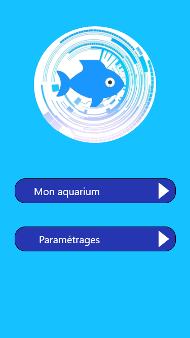

# E-quarium

Dans le cadre de notre projet tuteuré, un projet pour un véritable client, nous avons eu comme demande, l'automatisation d'un aquarium.  
Pour ce faire nous devions mettre en place un système sur Raspberry qui gère physiquement l'aquarium (température, lumiere...) et une application android permettant de gérer le tout.

Les langages utilisés pour ce projet sont le python et le kotlin.

Ce projet a été réalisé avec : [Aymeric Bachelet](https://github.com/aymeric-bachelet), [Samuel Goupil](https://github.com/samuelGoupil) et [Etienne Couzon](https://github.com/EtienneCOUZON)

## Voici quelques maquettes de l'application : 

 
